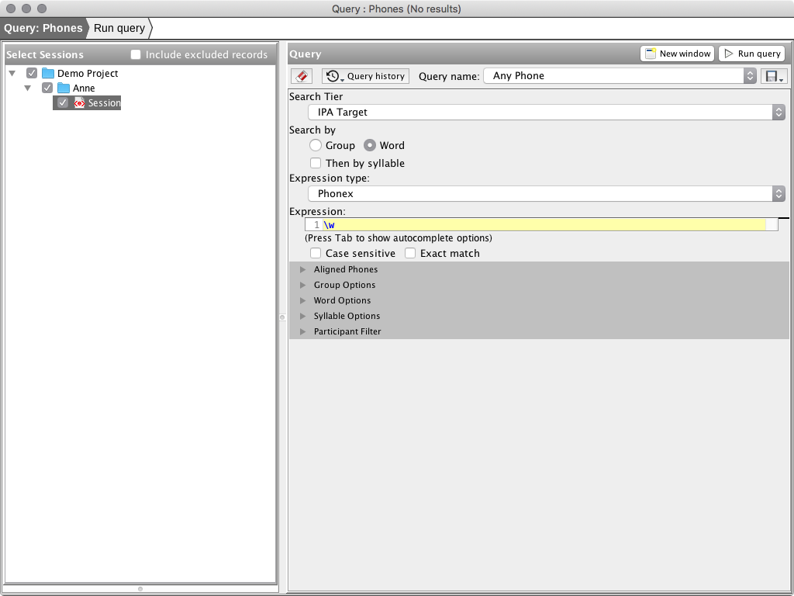
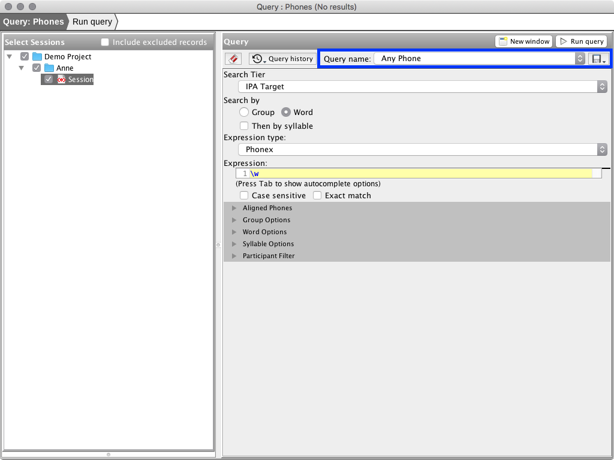
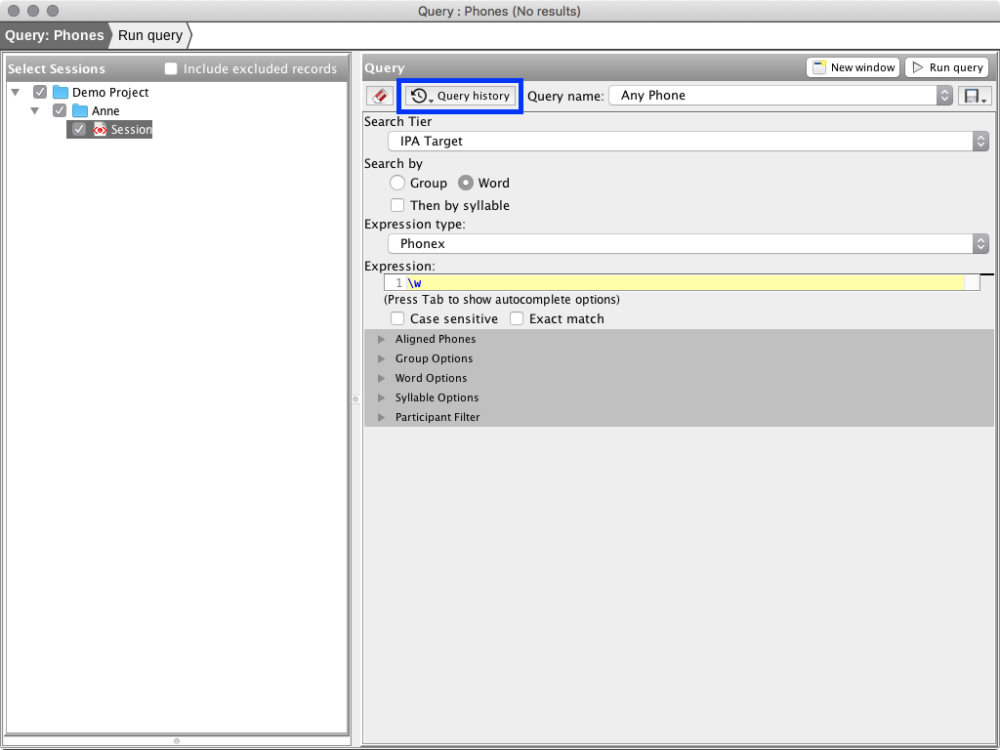
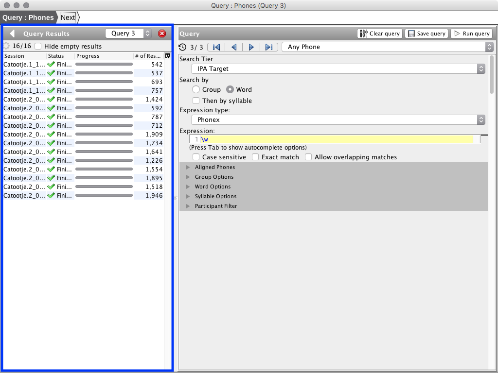

# Step 1: Query

The first step of the query wizard is to select sessions enter query parameters. Once query paremeters have been entered, click the 'Run Query' button (shortcut ```F7```) to execute the query.  After a query has completed you may open individual session results or continue to [Step 2: Report Composer](./query_wizard_report.md).



## Named Queries

Named queries are available via a combo-box menu in the top-right portion of the query parameters section.  To save the current set of parameters as a new named query using the save button and the end of the toolbar and choose 'Name Query' from the drop down menu.



## Query History

The parameters of each executed query are saved in a query history unique to each query type (e.g., Phones, Data Tiers, etc.)  When opening the Query and Report wizard the most recent entry (i.e., the previously executed query) in the query history is loaded. Query history can be viewed using the 'Query history' button in the toolbar of the query form. Double-clicking an item in the displayed popup 



## Query Results

Queries are executed by clicking the 'Run Query' button. Result sets are displayed in a table on the bottom-left portion of the wizard (under the session selector) in a view named 'Query Results.' Queries can be executed more than once, the results of each execution will be titled 'Query 1', 'Query 2', 'etc.' You can select the active result set using the combo-box in the top-right corner of the Query Results view. Result sets may be discarded by clicking the '-' button in the top-right corner of the Query Results view (or by using the 'Query' window menu.)



> Only the active result set will be used in the report steps of the wizard. The active result set is indicated in the title of the window.

Results from executed queries are shown in the session selector tree to allow comparisons between executed queries for individual sessions. Result sets may be viewed by double-clicking the result set in the tree or in the Query Results view. Results will be displayed in a table along with the associated session. For more information see [View Result Set](tasks/ViewResultSet.xml).
