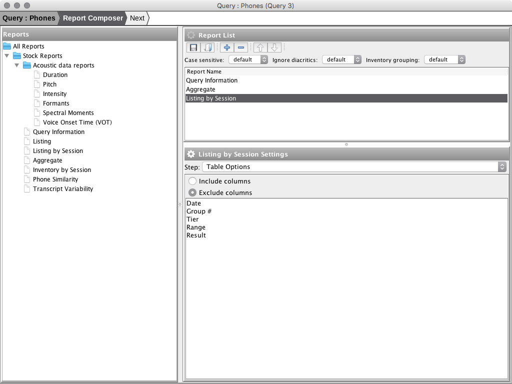
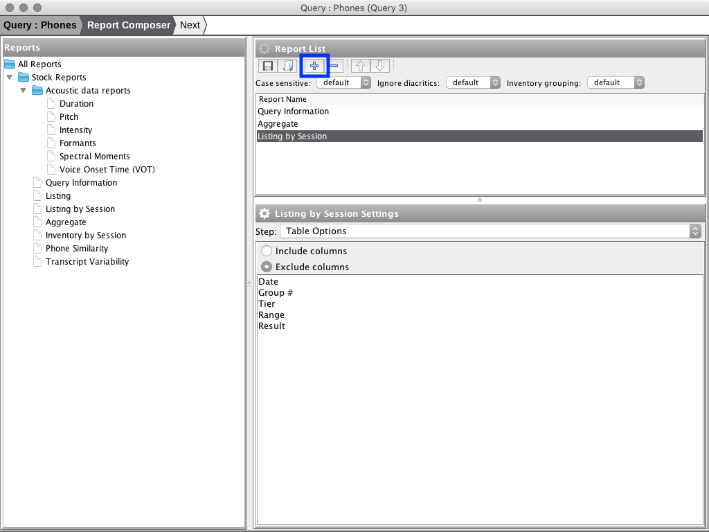
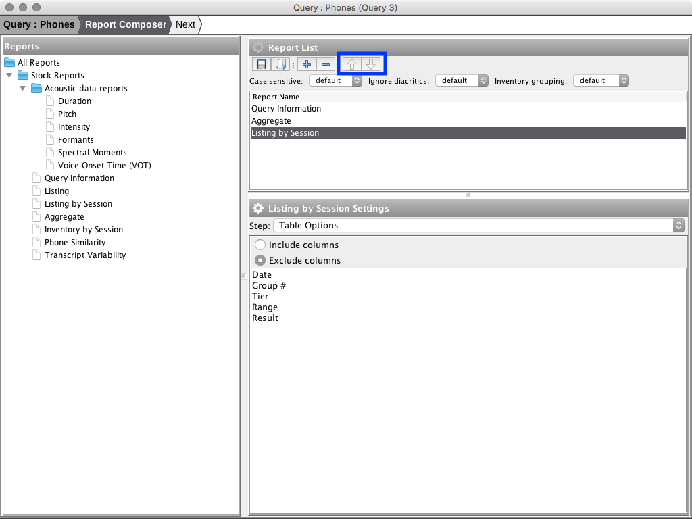
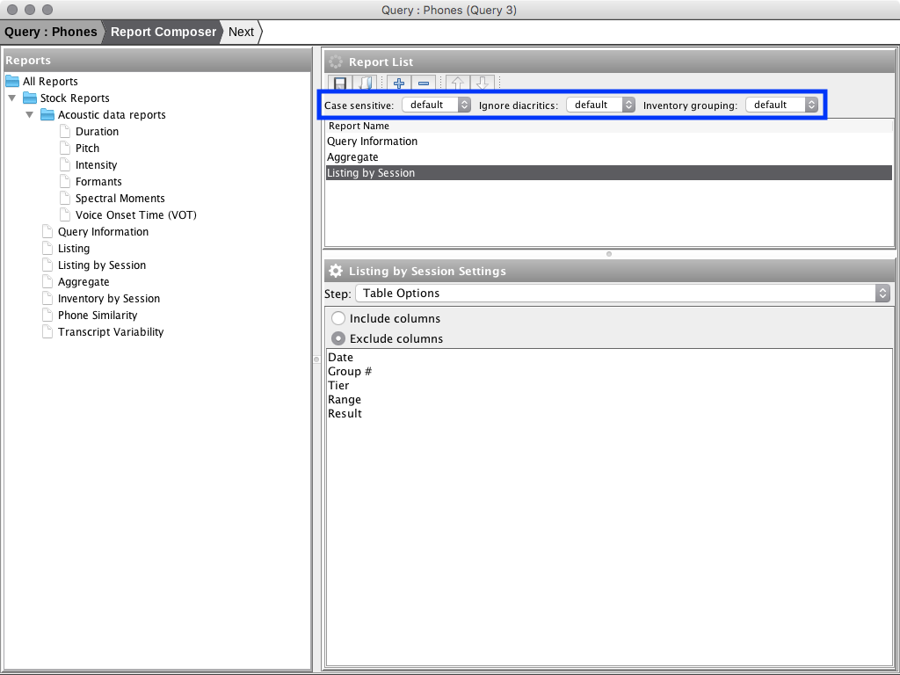

# Step 2: Report Composer

The Report Composer step allows configuration of the generated report. The composer has three main views: Reports - a list of all available report sections; Report List - a list of report sections which have been added to the report configuration; and a Settings view in the bottom-right which allows configuration of report sections highlighted in the Report List view.

When opened, the Report Composer will load the previous report configuration for the query.  If no previous configuration was found a default report consisting of the sections Query Information, Aggregate, and Listing by Session is loaded.

## Save/Load Report Configuration

Report configuration can be saved and loaded from disk using the save/browse buttons in the Report List toolbar.

## Add Section to Report

To add a report section to the current report configuration do one of:

 1. Highlight the report section in the 'Reports' view and click the '+' button in the 'Report List' view
 1. Double click the report section in the 'Reports' view
 1. Drag the report section from the 'Reports' view into the 'Report List' view

## Remove Section from Report

To remove a report section from the current report configuration:

 1. Highlight the report section in the Report List view
 1. Click the '-' button in the Report List toolbar
 

## Reorder Report Sections

To reorder report sections do one of:

 1. Highlight the section in the Report List view and use the up/down buttons in the toolbar
 1. Use the mouse to drag and drop report sections in the Report List view

## Global Report Options

Three global report options are available:

 1. case sensitive
 1. ignore diacritics
 1. inventory grouping

### Case sensitive

Modify case sensitivity where applicable.  The options are:

 1. default - use settings as defined in report section settings
 1. yes - override report section settings and turn on case sensitivity where applicable
 1. no - override report section settings and turn off case sensitivity where applicable
 
### Ignore diacritics

Modify ignore diacritics settings where application.  The options are:

 1. default - use settings as defined in report section settings
 1. yes - override report section settings and turn on ignore diacritics where applicable
 1. no - override report section settings and turn off ignore diacritics where applicable
 
### Inventory Grouping

Choose longnitudinal grouping column for aggregate inventories:

 1. default - use settings as defined in report section settings
 1. session - use session name as longnitudinal grouping column
 1. age - use age as longnitudinal grouping column

## Report Section Settings

To modify settings for a report section:

 1. Highlight the report section in the Report List view
 1. Use the bottom-right view to modify settings for the report section.
