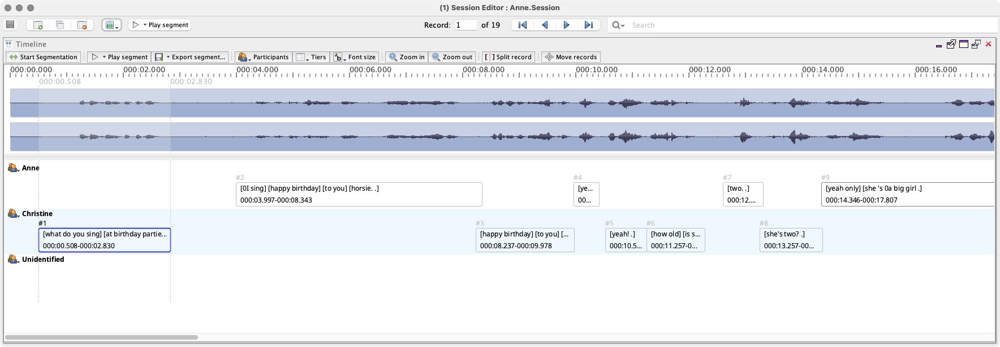
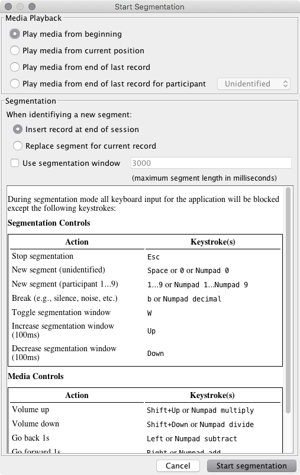

# Timeline (beta)

The **Timeline** view displays the waveform for the session audio (when the audio file is available) as well as associated record data for each selected participant along a horizontal timeline. The primary purpose of the **Timeline** view is to aid with segmentation and alterations of existing record segments.



The **Timeline** view has three main components:

 1. The timebar 

    The timebar is displayed at the top of the **Timeline** view and extends across the entire width of the view panel. Ticks are drawn every 10px with a major tick at every 100px. Time values are printed at every 2nd major tick. 
    
 1. The waveform

    The waveform is displayed if session audio is available. If session audio is not available, a prompt to address the issue is displayed at the bottom of the view.

 1. The record grid

    Records are displayed in dedicated rows for each speaker selected (from the *Participants* menu of the Timeline's toolbar); for each record, the data tiers selected (from the *Tiers* menu) are visible. The current record is highlighted with a blue border, also with the record number printed in black. Record segments may be adjusted via mouse interaction by either dragging the record segment along the timeline; or by adjusting the start/end values using displayed markers (dotted lines). Records for any given participant can also be assigned to different participants by dragging the relevant record to a different row.

## Actions

### Play segment

To play the segment of the current record or selection press ```space``` (when not in segmentation mode) or use the menu in the toolbar or contextual menu.

### Adjust segment times

Segment start and end times may be adjusted individually using the boundary markers (dotted lines) corresponding to the beginning and end of records. The start and end markers are always visible for the current record and are displayed when hovering over the end points of other record segments. Records may also be dragged horizontally along the timeline to adjust both start and end times simultaneously.

### Delete record

To delete the current record select *Delete record* from the contextual menu or press ```Delete``` on the keyboard (after selecting the record to be deleted.)

### Media Player Position

If the **[Media Player](./editor_view-media_player.html "Media Player")** view is open, playback position can be changed by clicking on the waveform tier. If ```CMD/CTRL``` is held when clicking, playback will begin at the position marked by the click (if the media is not playing already).

### Participants

Record data is printed by participant in rows. By default all participants plus a row for *Unidentified* records are visible.

#### Hide/Show Participant

Participant visiblity can be toggled using the *Participants* menu in the toolbar or option within the contextual menu.

#### Add Participant

To add a new participant to the session, click *Add Participant* in the *Participants* menu or select *Participants* > *Add Participant* within the contextual menu.

#### Change Participant

Participant assignment for a record may be altered using the mouse by dragging the record segment up and down across the different rows of the record grid. You may also use ```CMD```/```CTRL``` + ```1```...```9``` to assign a different participant using the keyboard. Participant number is determined by position in the list of currently visible participants. ```CMD```/```CTRL``` + ```0``` will set the record participant as "Unidentified".

### Hide/Show Tier

By default the *Orthography* and *Segment* tiers are shown in the record grid. Tier visibility may be toggled using the *Tiers* menu or similar option in the contextual menu.

### Zoom Out/In

The zoom out/in actions will decrease/increase the horizontal resolution of the waveform within the timeline. These actions are available in the toolbar and contextual menus.

## Special Modes 

### Segmentation

Segmentation is the process of assigning segment times for records using the keyboard, usually while media is playing. To enter the Segmentation Mode, click the *Start Segmentation* button in the toolbar. Before segmentation begins, a dialog is displayed with options for media playback and segmentation behaviour. The **[Media Player](./editor_view-media_player.html "Media Player")** view must be loaded within the Session Editor's interface. 



If session media is loaded the following media playback options are available:

 1. Play media from beginning.
 1. Play media from current position (in media player view.) This is the default option.
 1. Play media from end of last record (by media time.)
 1. Play media from end of last record for participant (with participant selection.)

Playback start position will determine where segmentation begins in the **Timeline**. If no media is available segmentation will always begin at ```000:00.000```.

There are two modes available for segmentation:

 1. Insert new record at end of session

    Use this option when segmenting a new media file or continuing segmentation. 

 1. Replace segment for current record
 
    Use this option when re-segmenting an already-segmented record or set of records. Uopn user action (e.g. typing a given participant number or ```1```, the current record is assigned the new segment time and participant (when relevant). Once all records segments have been overwritten using this mode, new records will be inserted at end of the session.
    
#### Segmentation Window

While segmentation mode is active, a yellow segment will be painted in the **Timeline** view. When a new record is identified using the ```Space``` or ```1```...```9``` or ```Numpad 1```...```Numpad 9``` keys the segment identified by yellow will become the media segment for the new record.

If *Use segmentation window* is not selected, segments will have no set limit in length; the beginning time of the segment is constrained by the end time of the preceding segment. If *Use segmentation window* is selected, segment duration will be limited to a time value indicated in milliseconds (default is 3000ms or 3 seconds.)


#### Segmentation Controls

During segmentation mode all keyboard input for the application will be blocked except the following keystrokes:

| Action | Keystroke(s) |
|---|---|
| Stop segmentation | ```Esc``` | 
| Break (e.g., silence, noise, etc.) | ```b``` or ```Numpad decimal``` |
| New segment (unidentified) | ```Space``` or ```0``` or ```Numpad 0``` |
| New segment (participant 1...9) | ```1```...```9``` or ```Numpad 1```...```Numpad 9``` |
| Toggle segmentation window | ```W``` |
| Increase segmentation window (100ms) | ```Up``` |
| Decrease segmentation window (1000ms) | ```Down``` |

#### Media Controls

| Action | Keystroke(s) |
|---|---|
| Volume up | ```Shift+Up``` or ```Numpad multiply``` |
| Volume down | ```Shift+Down``` or ```Numpad divide``` |
| Go back 1s | ```Left``` or ```Numpad subtract``` |
| Go forward 1s | ```Right``` or ```Numpad add``` |
| Go back 5s | ```Shift+Left``` or ```Shift+Numpad subtract``` |
| Go forward 5s | ```Shift+Right``` or ```Shift+Numpad add``` |

### Split Record

Records segments may be split using the record grid. To enter split mode, select the segment to ne split, press the ```S``` key, press the "Split Record" button in the toolbar, or select *Split record* from the contextual menu. A new marker will appear in the middle of the current record segment. This new marker can be dragged to adjust the position of the record split. Press ```Enter``` to accept the record split as shown and create the new record. Split mode can be exited using the ```Escape``` key and will also exit if the current editor record is switched or the current record segment is modified.


Record data may be split by word group number by using the ```0```...```9``` keys on the keyboard. ```0``` will move all record data into the new record while ```1```...```9``` will split data after group 1, 2, etc,. Split position can be set using the context menu as well.


## Warnings

The following warnings will be indicated in the **Timeline** view:

 1. Overlaping segments
 1. Segments exceeding media time

Warnings are indicated by a red flag shown next to the record numbers where warnings exist. Details about the warning will be shown in a tooltip displayed when hovering over the flag icon.

