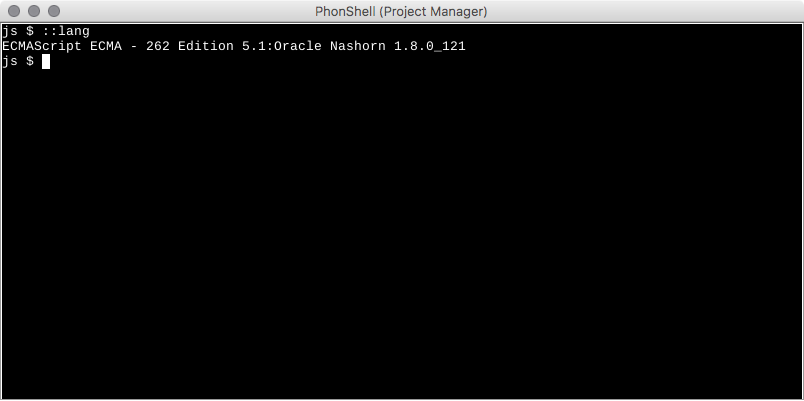

# PhonShell

*PhonShell* is a plug-in introduced with *Phon 2.0* which provides a scripting environment for *Phon*.  *PhonShell* is available from the *Tools* windows menu. The *PhonShell* console is associated to the window from which it was opened and will be closed when the parent window is closed.



## Usage

When opening *PhonShell*, you will be presented with a prompt such as:

```
js $
```

The first part of the prompt ```js``` indicates the language being processed (in this case it's JavaScript.)  *PhonShell* can execute statments in any scripting language available to the running Java virtual machine.  By default, *PhonShell* supports JavaScript and [Groovy](http://groovy.codehaus.org).

## Built-in Commands

### ```::langs```

Print a list of available languages.

```
js $ ::langs
ECMAScript 1.8:Mozilla Rhino 1.7 release 3 PRERELEASE
Groovy 2.2.1:Groovy Scripting Engine 2.0
```

### ```::lang <lang>```

Switch to the specified language.  Excluding ```<lang>``` will print the current language setting.

```
js $ ::lang Groovy
Groovy 2.2.1:Groovy Scripting Engine 2.0
groovy $
```

Notice how the prompt has changed to indicate the new language setting.

### ```::exec <script>```

Execute the specified script.  The script may be a file on disk, or any readable URL.

```
js $ ::exec "C:\Users\Me\MyPhonScripts\SomeScript.js"
...
```

### ```clear```

Clears the screen.

```
js $ clear
```

### ```reset```

Reset the scripting environment, discarding all variables in the current context.

```
js $ reset
```

### ```> <buffer>```

Output from statements/scripts is output to the console by default.  To re-direct the output to a *Phon* buffer window, terminate your statement with ```> <buffer>```, where ```<buffer>``` is the name of a new *Phon* buffer.  If a buffer with the given name already exists, it is overwritten.

```
js $ println("Hello World!");
Hello World!
js $ println("Hello World!"); > out
js $
```

After executing the second statement, "Hello World!" will be printed in a new *Phon* buffer named 'out'.

### ```>> <buffer>```

Data may also be appended to currently a existing buffer by using the ```>>``` operator.  If the named buffer does not exist it will be created.

```
js $ println("Hello World..."); >> out
js $ println("goodbye sanity!"); >> out
js $
```

In the first statement, 'Hello World...' is printed in a new Phon buffer named 'out'.  In the second statement 'goodbye sanity!' is appended to the same buffer.

## Built-in Variables

### ```window```

Provides a reference to the window from which the *PhonShell* console was opened.  For the Project Manager this will be an instance of ```ca.phon.app.project.ProjectWindow``` and for the Session Editor this will be an instance of ```ca.phon.app.session.SessionEditor```.  References to the current project and session can be obtained using the window variable.

```
js $ window.project
ca.phon.project.LocalProject@2d014748
js $ window.project.name
MyProject
js $ window.session.name
MySession
js $ window.session.recordCount
45
```

### ```__last``` 

The last value returned by executing a statement.

```
js $ x = 1+4;
5.0
js $ __last
5.0
js $ __last + 1
6.0
```
